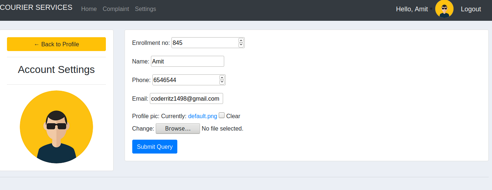

# Courier_Services
This web app is developed in Django which manages the courier services along with a complaint portal for interaction between user and an admin.
# AdminPage-
Below is the main page visible to the admin.Here the admin can manage the admin can search for the student and manage there parcels. 

This page allows admin to manage the parcel and information of a particular student. 

This page allows admin to create new id if new rooms are created in the hostel.

This page is the complaint portal where admin can see the complaints.

# UserPage-
Below is the main page visible to the student.Here the student can view his current and past parcel record.

This page allow user to change its information.

# ComplaintPortal-

The complaint portal is made using the use of Django-Channels.The Portal is implemented using channel layers which uses Redris as its backing store.So for that we need to install channels_redis so that Channels knows how to interface with Redis.To install run the following command:

$python3 -m pip install channels_redis

To start a Redis server on port 6379, run the following command:

$ docker run -p 6379:6379 -d redis:5

This is the admin portal-

This is the user portal-

